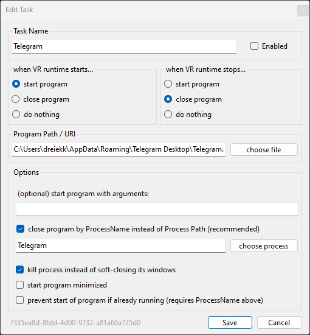

# OpenVR-Autostarter

Launch and stop programs with OpenVR / SteamVR.

## Screenshots



## Features

- Configure settings via the simple UI
- Autostarter starts/stops itself with your OpenVR runtime; no background task running, when you're not in VR
- Choose to close programs gracefully or force-kill the process
- Optionally specify start arguments for each program
- Reverse mode - stop programs at VR startup and start programs at VR shutdown
- Test your configuration without starting VR


## Installation

You may need to install the .NET Runtime 4.8 to run this program.

Download the latest setup from the [Releases](https://github.com/dreiekk/OpenVR-Autostarter/releases/latest) page.

### Build it yourself from souce

This project is built in .NET 4.8 and Visual Studio 2019.

Clone this git repository
```bash
  git clone https://github.com/dreiekk/OpenVR-Autostarter
```
and open the solution `OpenVR-Autostarter.sln` in Visual Studio 2019.

The installer is generated with and [InnoSetup](https://github.com/jrsoftware/issrc) and the related `OpenVR-Autostarter.iss` script.

## How to contribute

Coming soon...


## FAQ

#### How does the autostart work?

OpenVR-Autostarter registers itself in your OpenVR runtime as an overlay application. It starts/stops with your VR runtime and runs your defined tasks from itself.

#### Where are user settings saved?

All user settings are saved at `C:\Users\<username>\AppData\Roaming\openvr_autostarter.xml`

